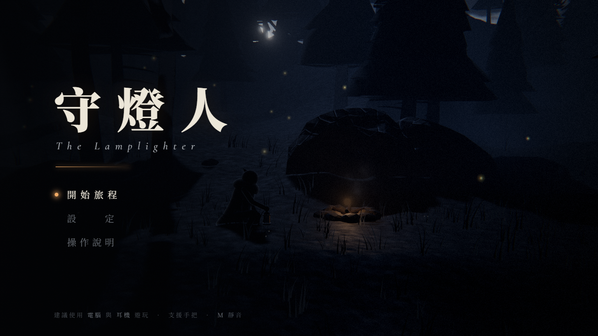
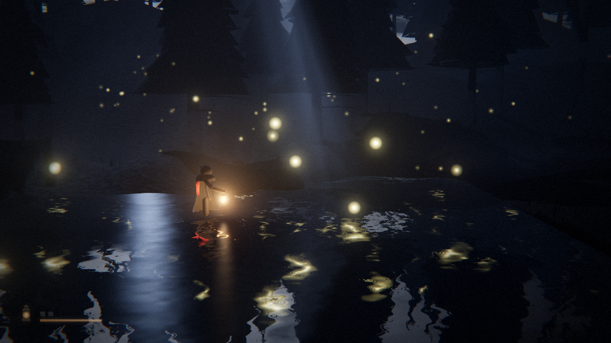
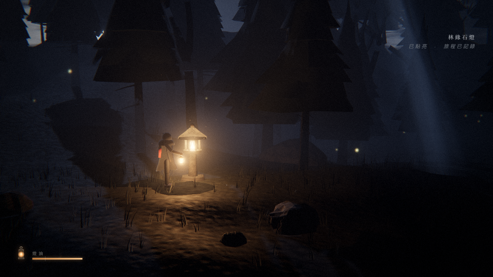
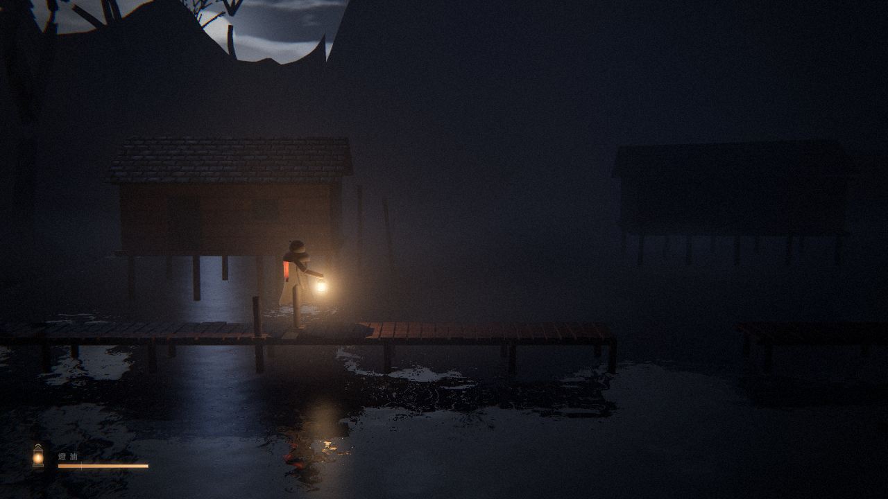
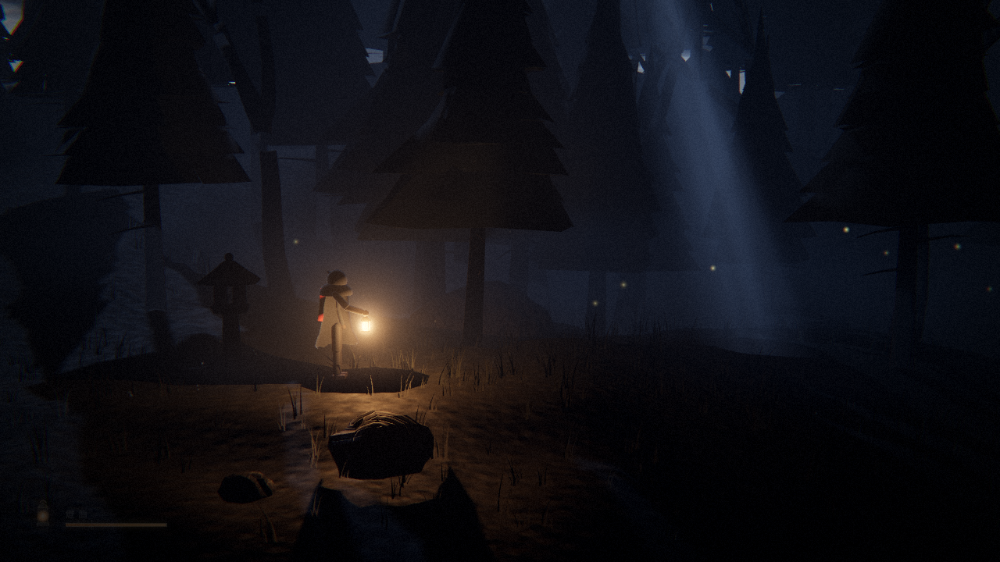
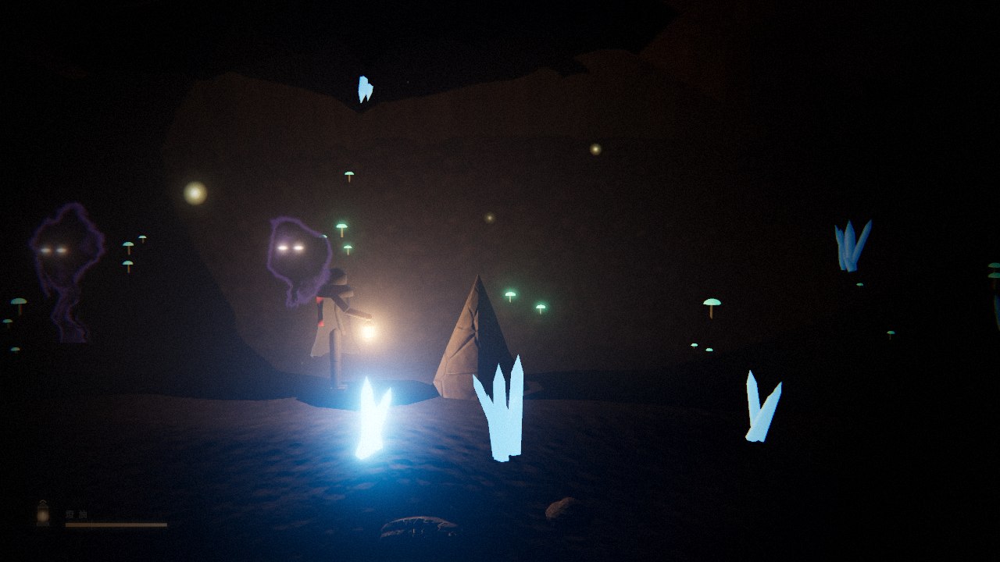
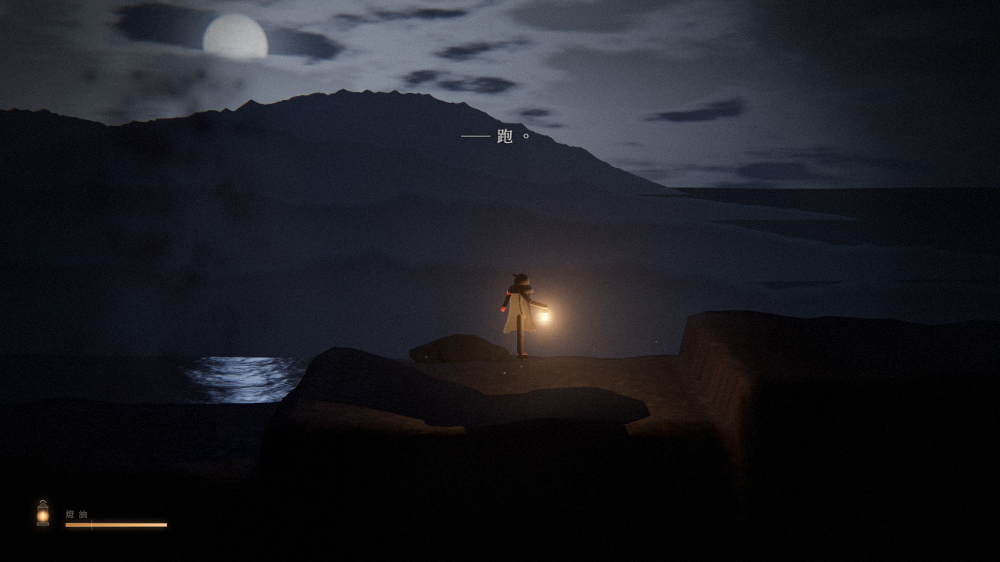
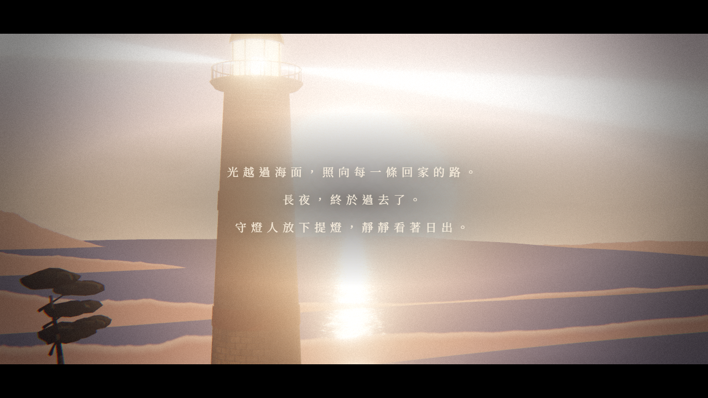

# 守燈人 · The Lamplighter

一段提著燈、穿越長夜的 2.5D 橫向冒險。

世界沉入長夜，燈塔熄滅，暗影從海上來。你是最後一個守燈人：沿途點亮石燈，收集螢火補充燈油，躲過或驅散暗影，最後走到海崖上點亮燈塔、迎來黎明。

全程約 10～15 分鐘，共五章：林緣、沉村、斷橋、螢窟、燈塔。

| | |
| --- | --- |
|  |  |
|  |  |
|  |  |
|  |  |

## 操作

| 按鍵 | 動作 |
| --- | --- |
| `A` `D` / `←` `→` | 移動 |
| `空白鍵` / `W` | 跳躍（長按跳得更高） |
| `S` + `空白鍵` | 從木板上落下 |
| `Shift` / 滑鼠右鍵 | 高舉提燈：照得更遠、逼退暗影、讓晶石顯形，但燈油消耗加快 |
| `F` / 滑鼠左鍵 | 光爆：消耗燈油，燒散周圍的暗影 |
| `E` | 點亮石燈（存檔點，補滿燈油）／長按點亮燈塔 |
| `Esc` | 暫停、設定 |
| `M` | 靜音 |

也支援 Xbox 配置的遊戲手把。建議戴耳機玩。

## 執行

需要 Node.js 18 以上。

```bash
npm install
npm run dev        # 開發模式：http://localhost:8000 （存檔後自動重新整理）
npm run build      # 輸出到 dist/
npm run preview    # 預覽 dist/：http://localhost:8080
```

`dist/` 只有三個檔案（`index.html`、`app.js`、`style.css`，約 780 KB），直接上傳到 itch.io、GitHub Pages 或任何靜態網站空間即可遊玩。

## 技術重點

完整的架構、渲染管線、各系統原理與測試工具見 [docs/TECHNOLOGY.md](docs/TECHNOLOGY.md)，以下是摘要。

畫面和聲音都是程式在執行時產生的，沒有任何外部圖片或音檔（字型除外，會從 Google Fonts 載入，離線時改用系統字型）。

**畫面（Three.js）**
- 透視攝影機搭配真實 3D 場景，用窄視角做出 2D 橫向捲軸的構圖，遠近視差是自然產生的
- 提燈是會投射即時陰影的點光源，並用擺錘物理隨走路晃動，光影也跟著搖晃
- 自製後製流程：以解析積分計算點光源在霧中的體積散射（每盞燈都有真實形狀的光暈）、Bloom、ACES 色調映射、調色、暗角、底片顆粒、色差
- 水面：反射加上 Fresnel、雨滴漣漪、燈火高光，海面還有月光（日出）的波光
- GPU 雨絲（靠近提燈的雨滴會被照亮）、懸浮塵埃、地面薄霧、月光光柱、螢火蟲、餘燼與煙
- 程序化生成：地形、松樹與枯樹（隨風擺動）、會被角色撥開的草、岩石、高腳屋、吊橋、石燈、燈塔、洞窟晶石，以及所有貼圖（反照率、法線、粗糙度）
- 角色：斗篷有布料擺動，紅圍巾用 Verlet 繩索模擬，走路、跳躍、落地、跪下點燈都是程序化動畫

**聲音（Web Audio API 即時合成）**
- 環境音：風（含陣風呼嘯）、雨、水聲、海浪、洞窟滴水、蟋蟀、貓頭鷹、蛙鳴、火焰劈啪聲
- 音效：依地面材質變化的腳步聲（草、泥、石、木板、吊橋、水、晶石）、雷聲（距離決定延遲）、光爆、暗影的低語與尖嘯、木板斷裂
- 生成式配樂：Karplus–Strong 撥弦（類似古箏）、氛圍 Pad、低音持續音；各章節情緒不同，靠近暗影時會疊加緊張層，追逐戰有太鼓節奏，結尾轉為 D 大調
- 洞窟裡會切換成較長的殘響

## 專案結構

```
src/
  main.js            啟動、主迴圈、選單
  render/            引擎、後製、天空與遠山、水、粒子、光柱、共用材質
  world/             關卡資料、地形、植被、建築物、大氣分區
  game/              遊戲流程、玩家物理、角色模型、攝影機、輸入、暗影、螢火、天氣
  audio/             音訊核心、音效、環境音、配樂
  ui/                介面
www/                 index.html、style.css（開發用）
scripts/             建置、開發伺服器、自動化測試
docs/                技術說明
screenshots/         展示截圖
```

關卡是資料驅動的，改 `src/world/level.js` 就能調整地形、平台、石燈、螢火、暗影、旁白和大氣分區。

## 測試腳本

```bash
npm run test:bot     # 用真實物理讓機器人從頭跑到尾，回報卡關或死亡位置
npm run test:chase   # 模擬終章追逐戰是否逃得掉
node scripts/tour.mjs "56,230,575,891" shot   # 在指定位置截圖（需先 npm run dev）
```

截圖腳本透過 puppeteer-core 使用系統安裝的 Microsoft Edge。

開發時可以在網址後加參數：`?skip` 跳過標題畫面，`?skip&x=430` 直接傳送到指定位置，`?q=low` 指定畫質。
